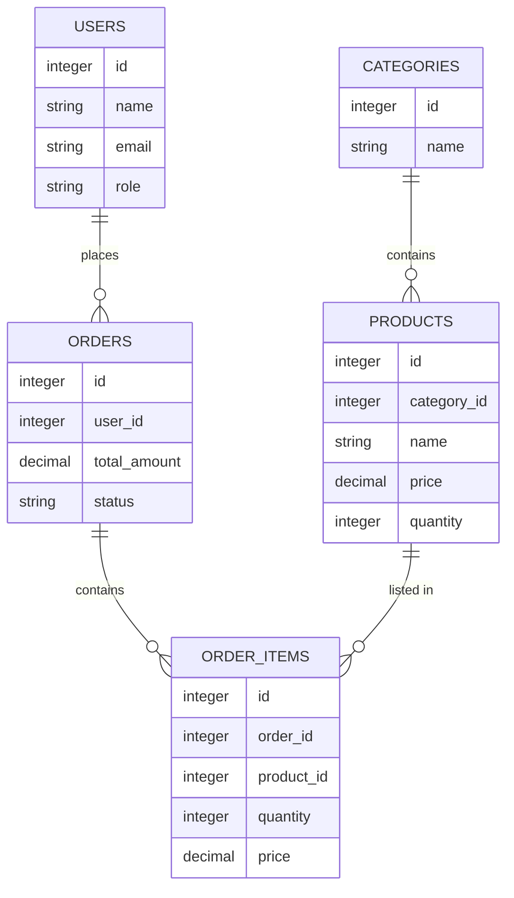
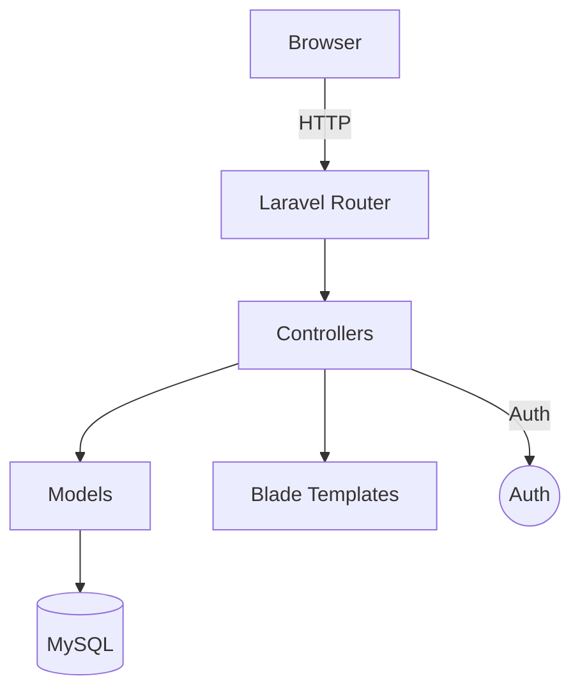

# Mini-Mart Project Documentation

## Project Overview
- **Name:** Mini-Mart (Laravel)
- **Description:** A lightweight Laravel-based e-commerce prototype for a small online grocery/retail store. It implements product categories, product catalog, cart, checkout, orders, and basic admin/customer management.
- **Purpose:** Serve as a minimal yet complete example of an online store allowing administrators to manage products/categories/users and customers to browse, add to cart, and place orders.

## Technology Stack
- **Framework:** Laravel (PHP)
- **Language:** PHP 8+ (project uses Laravel framework conventions)
- **Frontend:** Blade templates, Vite (assets in resources/js, resources/css)
- **DB:** MySQL / MariaDB / SQLite (via Laravel's database layer)
- **Testing:** Pest / PHPUnit (tests/)

## Primary Features
- Public product catalog (list, detail)
- Product categories
- Shopping cart (add/update/remove)
- Auth (register, login, logout)
- Checkout and order placement (customer profile + shipping details)
- Admin area (protected by `AdminMiddleware`) for managing categories, products, users, orders
- Customer area for viewing orders and profile

## Who Can Use This Project
- Developers learning Laravel full-stack features
- Small teams building a minimal e-commerce demo
- Educators demonstrating MVC, migrations, Eloquent relationships

## Quick Start / Installation
1. Clone the repo and cd into it.
2. Install PHP dependencies:

```bash
composer install
```

3. Install frontend dependencies and build assets (if needed):

```bash
npm install
npm run dev   # or npm run build for production
```

4. Copy `.env.example` to `.env` and configure DB credentials and `APP_URL`.

```bash
cp .env.example .env
php artisan key:generate
```

5. Run migrations and seed (optional):

```bash
php artisan migrate
php artisan db:seed
```

6. Serve the app:

```bash
php artisan serve
```

7. Visit `http://127.0.0.1:8000`.

## Environment / Common Config
- Database config: `config/database.php` controlled by `.env` variables `DB_CONNECTION`, `DB_HOST`, `DB_PORT`, `DB_DATABASE`, `DB_USERNAME`, `DB_PASSWORD`.
- Mail, queue, cache, and other Laravel features follow `.env`.

## Database Schema (Models & Migrations)
The project uses the following primary tables and Eloquent models:

- `users` — Model: `App\Models\User`
  - Fields: `id`, `name`, `email` (unique), `password`, `phone`, `address`, `role` (default `customer`), `remember_token`, timestamps
  - Relationships: `hasMany` Orders

- `categories` — Model: `App\Models\Category`
  - Fields: `id`, `name`, `description`, timestamps
  - Relationships: `hasMany` Products

- `products` — Model: `App\Models\Product`
  - Fields: `id`, `category_id`, `name`, `description`, `price` (decimal), `quantity` (int), `image_url`, timestamps
  - Relationships: `belongsTo` Category, `hasMany` OrderItems

- `orders` — Model: `App\Models\Order`
  - Fields: `id`, `user_id`, `total_amount`, `status`, `payment_method`, `shipping_name`, `shipping_phone`, `shipping_address`, timestamps
  - Relationships: `belongsTo` User, `hasMany` OrderItems

- `order_items` — Model: `App\Models\OrderItem`
  - Fields: `id`, `order_id`, `product_id`, `quantity`, `price` (price at time of order), timestamps
  - Relationships: `belongsTo` Order, `belongsTo` Product

Migration sources: `database/migrations/0001_01_02_000000_create_categories_table.php`, `0001_01_03_000000_create_products_table.php`, `0001_01_04_000000_create_orders_table.php`, `0001_01_05_000000_create_order_items_table.php`, `0001_01_01_000000_create_users_table.php`.

### Relations Summary
- User 1 —— * Order
- Category 1 —— * Product
- Product 1 —— * OrderItem
- Order 1 —— * OrderItem
- OrderItem * —— 1 Product

## ER Diagram (Mermaid)


## Controllers & Responsibilities
(Controllers referenced by routes defined in `routes/web.php`)

- `App\Http\Controllers\HomeController`
  - `index()` — show homepage / landing view

- `App\Http\Controllers\AuthController`
  - `showRegister()`, `register()` — registration form + submit
  - `showLogin()`, `login()` — login form + submit
  - `logout()` — log out user

- `App\Http\Controllers\ProductController`
  - `index()` — product list (public)
  - `show(Product $product)` — product detail

- `App\Http\Controllers\CartController`
  - `index()` — show cart
  - `add(Product $product)` — add item to cart (POST)
  - `update(Product $product)` — update item quantity (POST)
  - `remove(Product $product)` — remove item from cart (DELETE)

- `App\Http\Controllers\CheckoutController`
  - `index()` — show checkout form (auth required)
  - `placeOrder()` — validate form, create `Order` and `OrderItem` rows, reduce product inventory

- Admin controllers (namespace `App\Http\Controllers\Admin`)
  - `CategoryController` — CRUD categories
  - `ProductController` — CRUD products (resource controller used)
  - `UserController` — list users, toggle role, delete
  - `OrderController` — list orders, show details, update status

- Customer controllers (namespace `App\Http\Controllers\Customer`)
  - `DashboardController` — customer dashboard
  - `OrderController` — customer's orders listing + show

- `App\Http\Controllers\ProfileController`
  - `edit()`, `update()` — profile management for customers

## Routes (Summary)
Key routes are defined in `routes/web.php`. Primary public routes:

- `GET /` — HomeController@index
- `GET /products` — ProductController@index
- `GET /products/{product}` — ProductController@show
- `GET /cart` — CartController@index
- `POST /cart/add/{product}` — CartController@add
- `POST /cart/update/{product}` — CartController@update
- `DELETE /cart/remove/{product}` — CartController@remove

Auth:
- `GET /register`, `POST /register`
- `GET /login`, `POST /login`
- `POST /logout`

Checkout & customer (requires auth):
- `GET /checkout`, `POST /checkout/place`
- `GET /customer/dashboard`, `GET /my-orders`, `GET /my-orders/{order}`
- `/customer/profile` edit & update

Admin (prefix `admin`, protected by `AdminMiddleware`):
- `GET /admin/dashboard`
- Category CRUD: `admin/categories*`
- Product resource: `admin/products` (resource)
- User management: `admin/users`, `admin/users/{user}/toggle-role`, `admin/users/{user}` (DELETE)
- Orders: `admin/orders`, `admin/orders/{order}`, `admin/orders/{order}/status`

## Form Submissions & Validation
- Registration: `name`, `email`, `password`, optional `phone`, `address` — validate required fields and unique email
- Login: `email`, `password` — standard auth validation
- Product create/edit (admin): `category_id`, `name`, `description`, `price`, `quantity`, `image_url` — validate numeric/required fields
- Category create/edit: `name`, `description`
- Cart actions: product id + quantity (positive int)
- Checkout (`placeOrder`): `shipping_name`, `shipping_phone`, `shipping_address`, `payment_method` — validate required and format of phone

Example payload (checkout place order):

```json
{
  "shipping_name": "Jane Doe",
  "shipping_phone": "0123456789",
  "shipping_address": "123 Main St, City",
  "payment_method": "Cash on Delivery"
}
```

## Order Placement Procedure (Methodology)
1. Customer submits checkout form (auth required).
2. Backend validates data and checks cart for items.
3. Start DB transaction.
4. Create `Order` with `user_id`, `total_amount`, `status` default `Pending`, shipping fields.
5. For each cart item:
   - Create an `OrderItem` with `order_id`, `product_id`, `quantity`, `price` (product price snapshot).
   - Reduce `products.quantity` by ordered amount (ensure non-negative; error if insufficient stock).
6. Commit transaction. If any step fails, roll back and return error.
7. Clear customer's cart and send confirmation (optionally email).

This flow is implemented in `CheckoutController::placeOrder()` (see controller file).

## System Architecture
- Follows classic MVC (Model-View-Controller) Laravel architecture.
- Web routes map to controllers which orchestrate business logic and return views or redirects.
- Database interactions use Eloquent models with migrations that define schema.
- Admin middleware guards admin routes by checking `User::role === 'admin'` (see `App\Http\Middleware\AdminMiddleware`).

High-level component diagram (Mermaid):



## Testing
- Tests live under `tests/` and use Pest / PHPUnit. Run tests with:

```bash
./vendor/bin/pest
# or
php artisan test
```

Focus on unit tests for model behavior and feature tests for flows like registration and checkout.

## Security Considerations
- Ensure `APP_KEY` is set and env not committed.
- Validate and sanitize all user input, especially in checkout and admin product uploads.
- Protect file uploads and ensure `image_url` is either a stored asset path or validated URL.
- Admin routes protected via `AdminMiddleware`.

## Common Maintenance Tasks
- To add a new product attribute: add column in migration (or new migration), update `$fillable` in `Product` model, update admin forms and validation.
- To add a payment gateway: implement service class, update `CheckoutController` to call gateway API before finalizing order status.

## Files of Interest (quick links)
- [routes/web.php](routes/web.php)
- [app/Models/Product.php](app/Models/Product.php)
- [app/Models/Category.php](app/Models/Category.php)
- [app/Models/Order.php](app/Models/Order.php)
- [app/Models/OrderItem.php](app/Models/OrderItem.php)
- [app/Models/User.php](app/Models/User.php)
- [database/migrations/0001_01_03_000000_create_products_table.php](database/migrations/0001_01_03_000000_create_products_table.php)
- [database/migrations/0001_01_04_000000_create_orders_table.php](database/migrations/0001_01_04_000000_create_orders_table.php)

## Future Improvements / Roadmap
- Add product images upload and storage handling
- Add full payment gateway (Stripe / PayPal)
- Add order history export and admin reports
- Add pagination, search, and filters for products
- Add API endpoints (Laravel API resources) for headless frontend or mobile apps

## Appendix: Useful Code Snippets
- Example Eloquent relationship (Product->Category):

```php
public function category()
{
    return $this->belongsTo(Category::class);
}
```

- Example transaction wrapper (order placement):

```php
DB::transaction(function () use ($cart, $user, $data) {
    $order = Order::create([...]);
    foreach ($cart->items() as $item) {
        $order->items()->create([...]);
        $item->product->decrement('quantity', $item->quantity);
    }
});
```

---

If you want, I can also:
- Generate PNG/SVG versions of the ER diagram, or
- Expand controller-by-controller documentation with method signatures and example requests.


